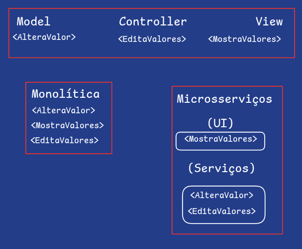

# Eng-Soft2-Grupo2
### Repositório do seminário de engenharia de software 2

### Grupo 2 -  Arquitetura de Software: 
**Integrantes:** João Pedro (202510545) e Gabriel Nunes (202410798)

[Material de aprensentação](./Apresentacao.pptx)

[Plano de Aula](./Plano_de_aula)

## Atividade Desplugada:

### Explicação:

&nbsp;&nbsp;&nbsp;Na atividade os alunos serão separados em grupos até 3 pessoas(Monolitica, ModelViewController, Microsserviços). Cada grupo receberá 1 folha com 3 estruturas de arquitetura de software. A seguir serão passadas ações que o software faz como < MostrarValores >, < AlteraValor >, < EditaValores >. E cada ação terá que ser posicionada onde cada grupo acredita que deve ser.

#### Exemplo:

### Ordem das ações:

 (esquerda pra direita)  
< MostraValor >&nbsp;|&nbsp;< EditarValor >&nbsp;|&nbsp;< BuscaProdutos >   
< MostraProduto >&nbsp;|&nbsp;< BuscaValores >&nbsp;|&nbsp;< AdicionaColaboradores >   
< CadastraColaboradores >&nbsp;|&nbsp;< EditaColaborador >&nbsp;|&nbsp;< ExcluiProduto >    
< MostraColaboradores >&nbsp;|&nbsp;< MostraInterafaceEdição >&nbsp;|&nbsp;< DeletaProduto >   
< BuscaColaboradores > 

## Gabarito

### Monolítico
< img src="./Atividade/Imagens/GabaritoMonolitico.png">

### Model View Controller
< img src="./Atividade/Imagens/GabaritoMVC.png">

### Microsserviços
< img src="./Atividade/Imagens/GabaritoMicrosservico.png">

## Avaliação

&nbsp;&nbsp;&nbsp;A avaliação será feita de uma forma geral, mostrando a silhueta que cada arquitetura fará, desmonstrando também, resumidamente, como as conexão são feitas para demonstrar como cada arquitetura interage entre si diferentemente.
